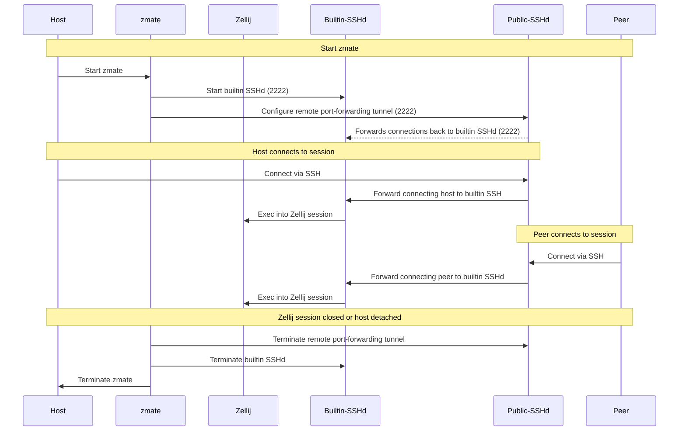

# zmate

💻 📤 👥 Instant terminal sharing; using Zellij.

[](https://asciinema.org/a/0ALuQtrvl62WPd7atwDZeyRzY)

zmate lets you invite peers into a local [Zellij](https://github.com/zellij-org/zellij) session over untrusted networks, despite you being behind a NAT gateway.
It is heavily inspired by [tmate](https://github.com/tmate-io/tmate).

zmate is (basically) server-less.
You only need a standard OpenSSH server with a public IP that serves as an entry-point for your peers.
Your peers only need a standard OpenSSH client.

Starting zmate inside an already open Zellij session will invite peers into that session.
Otherwise zmate will spin up a new Zellij session with a random name.

## How does it work?

zmate configures an ephemeral SSH remote port-forwarding tunnel on your public SSH server, pointing back to a local high-port.
It then starts a minimal SSH server on that local high-port, that throws connecting clients directly into a Zellij session.
Peers connecting to the high-port on your server via SSH are forwarded through the tunnel directly into your local Zellij session.
Once the host terminates zmate (by closing the Zellij session), the remote port-forwarding tunnel and internal SSH server are terminated and all peers automatically kicked.

> The host should always terminate the Zellij session by closing all tabs and panes.
> Simply detaching will still close zmate and therefor terminate the builtin SSH server and the tunnel.
> However, it will leave behind a dangling Zellij session and also likely screw up your peers' terminal, because their connection gets terminated very disgracefully.

### zmate Session Life-Cycle



## Security Model

Both, the remote port-forwarding and the builtin minimal SSH server, are initiated and terminated with zmate.
While zmate is not running, no listening-port will be bound, neither on your server, nor locally.
You can choose the port on which to bind when you start zmate; default is 2222.

The builtin minimal SSH server implements authentication and authorization solely via the username.
Connecting peers must know the correct username.
Peers connecting with a wrong username are immediately disconnected.

By default, zmate will bind the builtin SSH server to `127.0.0.1:2222`.
If you explicitly decide to bind it to `:2222`, you can make your Zellij session available on your LAN.
Peers in your network can then connect to the high-port on your Zellij host, directly, effectively bypassing the round-trip through the tunnel.

If you don't provide an SSH host-key, zmate will generate a random in-memory key, every time it starts.

## Installation

### Prerequisits

You as the host:

- [Zellij](https://zellij.dev/)
- a standard [OpenSSH](https://github.com/openssh/openssh-portable) client
- an SSH server with a public IP address, configured for password-less authentication (loaded ssh-agent with keys)

Your peers:

- a standard [OpenSSH](https://github.com/openssh/openssh-portable) client

### Install via Go

```
go install github.com/ziinaio/zmate@latest
```

Or you can download the [latest release build](https://github.com/ziinaio/zmate/releases) for your platform.

## Usage

```
NAME:
   zmate - 💻 📤 👥 Instant terminal sharing; using Zellij.
           
   ███████╗███╗   ███╗ █████╗ ████████╗███████╗
   ╚══███╔╝████╗ ████║██╔══██╗╚══██╔══╝██╔════╝
     ███╔╝ ██╔████╔██║███████║   ██║   █████╗  
    ███╔╝  ██║╚██╔╝██║██╔══██║   ██║   ██╔══╝  
   ███████╗██║ ╚═╝ ██║██║  ██║   ██║   ███████╗
   ╚══════╝╚═╝     ╚═╝╚═╝  ╚═╝   ╚═╝   ╚══════╝

USAGE:
   ziina [global options] command [command options]

DESCRIPTION:
   
   Invite peers in you LAN.

     ziina -l 192.168.1.2:2222

   Invite peers using **ssh.example.com** as entrypoint for your peers:

     ziina -s ssh.example.com

   Show connection info:

       echo $ZIINA_CONNECTION_INFO
       echo $ZIINA_CONNECTION_INFO_RO


COMMANDS:
   help, h  Shows a list of commands or help for one command

GLOBAL OPTIONS:
   --listen value, -l value    Listen on this port. (default: "127.0.0.1:2222")
   --server value, -s value    The SSH server to use as endpoint.
   --user value, -u value      Username for SSH authentication.
   --host-key value, -k value  Path to the private key for SSH authentication. (default: "ssh_host_rsa_key")
   --help, -h                  show help
```

### Host

```
zmate -s myserver
```

This will generate a random 7 digit Zellij session-name.
Use it as username when connecting as client.

### Peer

```
ssh -p 2222 <session-name>@myserver
```

---

Made with :heart: at :artificial_satellite: c-base, Berlin.
